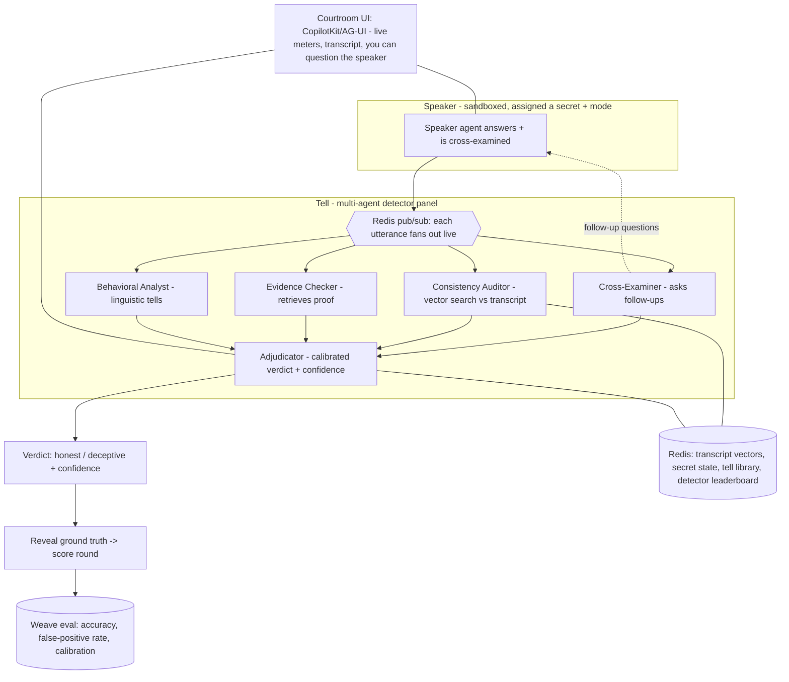

# Tell — a live lie detector for AI agents

**A panel of AI agents that interrogates any claim and catches deception the moment it leaks.** A speaker agent is questioned in real time by a team of detector agents using genuinely different methods — active cross-examination, consistency-over-time, evidence-checking, behavioral tells. Their suspicion meters move live, and the instant the speaker starts to deceive, the panel converges and calls it — *"DECEPTION — 87%."* Then the ground truth is revealed.

> Built for WeaveHacks 4 (Multi-Agent Orchestration). Two cooperating agent teams (the panel vs. the speaker), an objective ground-truth oracle, calibrated confidence, and a perceivable five-second "tell" — the meter spike at the moment of the lie.

---

## 0. Confirmed event facts (WeaveHacks 4)

- **When/where:** June 6–7, 2026, W&B SF office (400 Alabama St). In person; be present Saturday to be prize-eligible.
- **Theme:** "Growing the team: orchestrating pipelines and wrangling swarms"; *"agents that work together while we're away."*
- **Sponsors:** Weave (W&B), Cursor, Redis, CopilotKit (AG-UI), OpenAI. Engineers onsite at labeled tables.
- **Prizes:** $15k+ and a Unitree G2 Pro robot dog. Sponsor prizes first, then 3 grand-prize winners.
- **Build window (overnight gap!):** hacking starts **Sat 11:15**; **office closes 9:00 PM Sat**; reopens **Sun 9:00 AM**; **submissions due 1:00 PM Sun**. §12 is timed to this.
- **Demo:** **3 minutes, strictly enforced**, both rounds, + 1–2 questions, ≤1–2 slides, heavy demo. 8 finalists present to the room; awards 4:30.
- **Submission:** Cerebral Valley platform (confirm DevPost too); public GitHub repo, all members, **<2 min demo video**, explicit sponsor-tool writeup. Team ≤5. **Entire project built at the event**; commit early & often.
- **Free credits (grab early, from Alex/Anna in yellow jackets):** $50 W&B Weave Inference, $50 OpenAI, $100 Cursor. WIFI `W&B Guest` / `Gumption`.
- **W&B MCP server** (`https://mcp.withwandb.com/mcp`): lets an agent read runs/traces/evals. Fast Weave setup: `npx add-skill altryne/weavify-skill`.

---

## 1. The problem (why this wins on Utility + fits W&B)

AI agents lie and hallucinate, and as we wire them into pipelines where one agent consumes another's output, an undetected fabrication propagates downstream as if it were fact. The harms are real and well-documented — fraud, misinformation, and the loss of human oversight over autonomous systems. The need that everyone in production feels: *before I trust this output, how do I know it's grounded — and how confident should I be?*

This is squarely Weights & Biases' world. W&B is an evals-and-observability company, and a **calibrated trust signal for agent outputs** is exactly the kind of thing their judges care about — it's evaluation, made live and adversarial.

---

## 2. Prior art & your wedge (read this first — uniqueness is scored)

Be honest and precise; the panel is technical. Deception and hallucination detection for LLMs is an active research area:

- **Mechanistic / white-box probes** read a model's internal activations to classify truthfulness (Azaria & Mitchell; "Truth is Universal"; CLAP). Powerful, but need model internals.
- **Hallucination detectors** use semantic entropy, metamorphic prompt mutations (MetaQA), and internal-state signals.
- **Behavioral vs. mechanistic** deception detection is a recognized split (Park et al.), and deceptive/"sleeper" agents are studied (Hubinger et al.).

The opening — and it's research-backed: a 2026 paper (*Probing the Limits of the Lie Detector Approach to LLM Deception*) found that truth probes are **much better at catching literal lies than deception *without* lying**, names this a **critical blind spot**, and explicitly calls for **behavioral approaches in dialogical settings** that model second-order beliefs. The field has also converged on **calibrated confidence** over binary verdicts.

**Your wedge (state it in the pitch):**
1. **Behavioral + dialogical, not mechanistic** — catches *strategic* deception (misleading without a false statement) that probes miss, by *interrogating* over a conversation.
2. **Black-box** — works on any agent or API; no access to model internals required.
3. **Multi-agent adversarial panel** — method-diverse detectors that cover each other's blind spots, with an active cross-examiner (most prior work is a single static classifier).
4. **Live and perceivable** — real-time suspicion meters and the moment of the "tell."
5. **Ground-truthed** — assigned speaker roles give an objective benchmark with **calibrated** confidence.

Honest framing: detecting LLM deception is *not* new; a live, black-box, multi-agent interrogation targeting the dialogical-deception blind spot, with calibrated confidence, is the contribution.

---

## 3. Core idea

Each round:

1. A **speaker agent** is privately assigned a topic, a secret, and a **mode** (§6): honest, lying, strategically deceptive (no literal falsehood), or hallucinating.
2. A **detector panel** questions and observes it in real time, each detector emitting a live **suspicion signal** with rationale.
3. An **adjudicator** fuses the signals into a **calibrated verdict + confidence** and decides when there's enough to call it.
4. The **ground truth is revealed** and the round is scored.

The "pop" is the perceivable turn: meters calm during honesty, then a visible spike at the instant deception begins, then the reveal. It's gripping, legible in one sentence, and backed by a real number.

---

## 4. The harness — the detector panel (the headline criterion)

Tell is itself a coordinated multi-agent team, and the panel is **load-bearing**: each detector uses a genuinely different method with a different failure mode, so the ensemble beats any single detector — and the cross-examiner *generates* the dialogue the others need.

- **Cross-Examiner** — actively asks follow-ups, pins down specifics, and probes for consistency. This is the agent that targets *dialogical* deception (the literature's gap); deception cracks under follow-up.
- **Consistency Auditor** — checks each new statement against the full transcript (Redis vector search) for contradictions. A deceiver must maintain a false model; contradictions leak over time.
- **Evidence Checker** — retrieves external evidence for falsifiable claims (web / W&B MCP). Catches lies *and* hallucinations on checkable facts.
- **Behavioral Analyst** — scores linguistic tells: hedging, evasion, over-specification, refusal to commit, confidence-vs-content mismatch.
- **Self-Consistency Prober** *(optional)* — re-asks the same question reworded or resamples the speaker; unstable answers signal fabrication (black-box, orchestrated semantic-entropy/MetaQA style).
- **Adjudicator** — fuses signals into a calibrated verdict + confidence (the "DECEPTION — 87%" call) and owns the *when-to-call* decision.

**Why a panel beats one (prove it live):** the Behavioral Analyst alone is fooled by a smooth liar; the Evidence Checker only helps on checkable claims; the Consistency Auditor needs enough dialogue. Show a single detector getting fooled, then the panel catching it because the Cross-Examiner's follow-up surfaced a contradiction the Consistency Auditor flagged. That contrast *is* the harness-sophistication score.

> **MVP collapse:** Saturday, ship the Cross-Examiner + Consistency Auditor + Adjudicator (the trio that already beats a static classifier). Add the Evidence Checker, Behavioral Analyst, and Self-Consistency Prober Sunday. The signal→fuse→verdict interface stays fixed.

---

## 5. Architecture



**Components:** a sandboxed **speaker runner** (assignable secret + mode); the **detector panel** (above); the **adjudicator**; a **Redis bus** that fans each utterance to all detectors in real time; the **courtroom UI**; and the **Weave eval** harness over a suite of rounds.

---

## 6. Ground truth & scoring (the oracle — this makes it rigorous)

You always know the truth because *you assign the speaker its mode*. Four modes, mapped to the research:

- **Honest** — truthful. (Tests false-positive rate: does the panel cry wolf?)
- **Lying** — states a known falsehood. (The easy case probes already handle.)
- **Strategically deceptive** — misleads *without* a literal false statement (evasion, cherry-picking, implicature). **This is the case the mechanistic probes miss — your flex.**
- **Hallucinating** — no ground-truth knowledge; confabulates confidently.

**Metrics (the Weave eval):**
- **Accuracy** — verdict matches assigned mode (honest vs. deceptive), broken down *by mode*.
- **False-positive rate** — flagging honest speakers as deceptive. Critical for credibility; show it's low.
- **Calibration (Brier score)** — does "87%" actually mean 87%? The field's preferred metric; a strong W&B story.
- **Panel vs. best single detector** — the ensemble lift, especially on the strategic-deception rounds.

---

## 7. Real-world applications (the "utilities")

The interrogation game is the *engine*; these are the *products*. (Your specific utilities list didn't come through — paste it and I'll fold it in; meanwhile, the obvious high-value ones:)

- **Trust scoring for agent outputs (W&B-native).** Before a downstream agent consumes another agent's answer, run it past the panel for a calibrated "grounded vs. confabulated" score. A live verification gate for multi-agent pipelines — on-theme and a real production need.
- **Scam / fraud / social-engineering detection.** The Cross-Examiner + Behavioral Analyst flag deceptive intent in a conversation (phishing, vishing, romance scams). Topical and visceral.
- **Due-diligence / interrogation assistant.** Stress-test a claim — a startup's metric, a résumé line, a witness statement — and surface inconsistencies. Resonates directly with founder/VC judges ("interrogate this pitch's claims").
- **AI-honesty red-team / alignment eval.** A benchmark for whether agents deceive under pressure and whether others can catch it — a genuine safety capability test.

Lead the demo with the live game; name the trust-layer application as the headline product.

---

## 8. Data model / interfaces

```jsonc
// Round
{
  "id": "r_017",
  "topic": "expense report for a client trip",
  "speaker_mode": "strategic_deception",      // honest | lying | strategic_deception | hallucinating
  "secret": "the $400 dinner was personal, not client",
  "difficulty": "hard",
  "transcript": [ /* utterances + cross-exam follow-ups */ ],
  "verdict": { "label": "deceptive", "confidence": 0.87 },
  "ground_truth": "deceptive",
  "correct": true
}
```

```jsonc
// DetectorSignal (emitted live per utterance)
{
  "detector": "consistency_auditor",
  "suspicion": 0.78,                          // 0..1, drives the live meter
  "utterance_ref": "u_06",
  "evidence": "Contradicts u_02: earlier said the dinner was a client meeting.",
  "rationale": "..."
}
```

```jsonc
// Verdict (adjudicator output)
{
  "label": "deceptive",
  "confidence": 0.87,
  "contributing_signals": ["consistency_auditor:0.78", "cross_examiner:0.71"],
  "decisive_detector": "consistency_auditor"
}
```

```jsonc
// EvalResult (over a suite of rounds)
{
  "n_rounds": 40,
  "accuracy": 0.90,
  "false_positive_rate": 0.07,
  "brier_score": 0.11,
  "by_mode": { "honest": 0.93, "lying": 0.97, "strategic_deception": 0.82, "hallucinating": 0.88 },
  "panel_vs_best_single": { "panel": 0.90, "best_single": 0.71 }
}
```

---

## 9. Weave integration (required, and a natural fit)

- **Trace every round:** the speaker, each detector's signal, the cross-examination, and the adjudicator's fusion — all under `@weave.op`. The trace tree shows the panel coordinating.
- **Eval is the core:** run a suite of rounds across all four modes as a Weave Evaluation; surface **accuracy, false-positive rate, by-mode breakdown, and calibration (Brier)**. Calibration is exactly what the field cares about, so it's a strong, on-brand story.
- **Money visuals:** the **panel-vs-best-single-detector** comparison and the **calibration plot** (does confidence mean what it says?).
- **W&B MCP (optional):** the Evidence Checker can read/verify via the MCP server; or use it for meta-analysis of past rounds.
- **Fast setup:** `npx add-skill altryne/weavify-skill`; `weave.init`, `@weave.op` are the stable primitives.

---

## 10. Sponsor mapping

| Sponsor | Role in Tell | Prize angle |
|---|---|---|
| **Weave (W&B)** | Round tracing; eval for accuracy/FPR/**calibration**; panel-vs-single chart | Core / required; "Best use of Weave" |
| **Redis** | **Pub/sub** fan-out of each utterance to detectors (live meters); **vector search** for the Consistency Auditor's contradiction-finding; secret/transcript state; **sorted sets** for the detector leaderboard + tell library | Multi-capability; strong Redis-prize fit |
| **CopilotKit / AG-UI** | The courtroom: live per-detector meters, transcript, verdict gauge, and **you can question the speaker yourself** (human-in-the-loop) | Front-end / AG-UI prize |
| **Cursor** | Build it; wire **W&B MCP into Cursor** to inspect traces while building | Sponsor usage; mention in submission |
| **OpenAI** | Models for the speaker, detectors, and adjudicator | Credits provided; mention usage |

---

## 11. Demo script (3 minutes, strictly enforced)

Rehearse 3×. Pre-stage three curated rounds so the live meters are real but the outcomes are deterministic.

- **0:00–0:25 — Hook.** "AI agents lie and hallucinate, and the standard detectors read model internals — which miss *strategic* deception in conversation. Tell is a panel of agents that interrogates any claim and catches it live." Show the courtroom UI.
- **0:25–1:05 — Honest round (credibility).** Speaker answers truthfully; meters stay calm; verdict HONEST. Proves it doesn't cry wolf — low false-positive rate.
- **1:05–2:00 — Deception round (the pop).** Speaker starts to deceive; the Cross-Examiner's follow-up surfaces a contradiction the Consistency Auditor flags; meters spike; **"DECEPTION — 87%."** Reveal ground truth: deceptive. The meter spike at the crack is the five-second hook.
- **2:00–2:40 — The flex.** A *strategic-deception* round (no literal lie): show a single mechanistic-style detector would miss it, but the panel catches it via cross-examination. Cut to the Weave **panel-vs-single** chart and the **calibration** plot (≈90% accuracy, low FPR, well-calibrated).
- **2:40–3:00 — Utility close.** "Point it at any agent's output, a scam call, or a due-diligence claim." Close: *"Tell is a trust layer for the agent era — it catches the lie the moment it leaks."*

---

## 12. Build plan (split days — mind the 9 PM Saturday close)

Hack **Sat 11:15 → 9:00 PM**, optional remote overnight, then **Sun 9:00 AM → 1:00 PM** (includes freezing + rehearsing + submitting). Core loop done before you lose the venue.

- **Phase 0 — Vertical slice (Sat 11:15–1:30).** Speaker runner with assignable secret + mode; one detector; Weave tracing. One round runs and is scored against ground truth.
- **Phase 1 — Interrogation loop (Sat 1:30–4:30).** Cross-Examiner (active follow-ups) + Adjudicator producing a calibrated verdict. Real honest-vs-deceptive detection with a confidence number.
- **Phase 2 — Panel + eval (Sat 4:30–9:00). PROTECT — hard 9 PM deadline.** Add the Consistency Auditor (Redis vector search) + Redis pub/sub fan-out; build the eval suite across the four modes (accuracy + FPR + Brier). By 9 PM: full panel catching lies with real metrics, end to end. That alone is a winning demo.
- **Overnight (optional, remote).** Add Evidence Checker / Behavioral Analyst; harden the strategic-deception speaker; build the panel-vs-single comparison.
- **Phase 3 — Flex + apps (Sun 9:00–11:00).** Curate the strategic-deception rounds; the panel-vs-single + calibration charts; wire one real application (point it at an agent output or a scam transcript).
- **Phase 4 — Courtroom UI (Sun 9:00–11:30, parallel).** CopilotKit: live meters, transcript, verdict gauge, human-question-the-speaker.
- **Phase 5 — Freeze, pre-stage, rehearse, submit (Sun 11:30–1:00).** Curate the three demo rounds; rehearse 3×; submit by **12:50** (repo, Weave link, <2 min video, sponsor writeup).

---

## 13. Scope cuts (top-down if behind)

1. Detector count — ship the trio (Cross-Examiner + Consistency Auditor + Adjudicator), add others only if time.
2. Human-question-the-speaker interjection.
3. Applications beyond the live game.
4. Fancy UI → meters + transcript + Weave charts.
5. Live rounds on stage → pre-recorded.

**Never cut:** the live meter spike at the moment of deception, the ground-truth reveal, and the accuracy/calibration number. Those *are* the project.

---

## 14. Risks + mitigations

- **"Is detecting LLM lying even meaningful?"** → Ground truth via assigned mode makes it objective; you distinguish lying / strategic deception / hallucination / honest, and report calibration. Cite the documented harms and the blind-spot paper.
- **Harness theater ("why a panel?").** → Prove panel > best single detector live, on a strategic-deception round.
- **Prior art.** → Lead with the wedge (§2): black-box, dialogical, multi-agent, live, calibrated — targeting the probes' blind spot.
- **False positives undermine trust.** → Track and *show* FPR; include honest rounds where the panel stays calm. A detector that cries wolf is worse than none.
- **The skilled liar fools the panel on stage.** → Curate validated rounds; be honest in Q&A about where it fails (a deception detector that admits its limits is more credible, not less).
- **Nondeterminism.** → Fix seeds/temperature; pre-stage the demo rounds.
- **Ethics/optics.** → This is a *detection* tool (safety/eval), and the speaker is sandboxed with assigned roles — you're not building a manipulation engine. Say so.

---

## 15. Why this wins (mapped to the confirmed rubric)

- **Creativity** — a live adversarial lie-detector courtroom for AI, targeting a *documented* blind spot (dialogical/strategic deception) that white-box probes miss. Fresh in-room and research-grounded — "have you seen this?" is a no.
- **Multi-agent harness sophistication** — a method-diverse detector panel + active cross-examiner + adjudicator vs. a speaker; two cooperating teams, provably better than a single detector, with the structure self-evidently justified.
- **Utility / impact** — calibrated trust scoring for agent outputs (W&B-native), scam detection, due-diligence interrogation. The VC judges feel it.
- **Technical execution** — objective ground truth across four deception modes, calibration/Brier, black-box (works on any agent). Rigor is visible.
- **Sponsor usage** — deep Weave (eval + calibration + traces), multi-capability Redis (pub/sub + vector + sorted sets), CopilotKit (courtroom + human-in-the-loop), OpenAI, Cursor.
- **Presentation & pitch** — the meter spike at the lie plus the reveal is a five-second hook with a real number behind it.

---

## 16. Stretch goals (after the core loop is solid)

- **Audience round** — let a judge secretly set the speaker's mode and watch the panel call it live (huge "it's real" moment).
- **Adversarial co-evolution** — let the speaker *learn* from rounds it won and watch detection accuracy fight back over time (the self-improving narrative).
- **Voice mode** — run the interrogation as audio for extra visceral impact (a past WeaveHacks judge built the leading voice-agent framework).
- **Trust-gate integration** — drop Tell in front of a real two-agent pipeline so a flagged output is blocked before the downstream agent consumes it.
- **Per-detector leaderboard** — show which method catches which deception type best (Redis sorted sets), a genuinely interesting result.

---

## 17. Submission checklist

- [ ] **Entire project built at the event**; commit early & often
- [ ] Public GitHub repo with run instructions
- [ ] **W&B Weave project** opened + link included
- [ ] Submitted on the **Cerebral Valley platform** (confirm DevPost too) — by **12:50 Sun**
- [ ] Unique team name + all members (emails/socials on your CV account)
- [ ] **<2 min demo video** — open on the meter spike at the lie (first-5-seconds hook)
- [ ] Description: 2–3 sentence summary, what it does, how it's built (orchestration protocols like MCP/A2A + frameworks), and **every sponsor tool + how**
- [ ] X / LinkedIn handles; post on socials right after

---

### One-line pitch for the room

> *"AI agents lie and hallucinate, and today's detectors read model internals — which miss the deception that actually happens in conversation. Tell is a panel of agents that interrogates any claim and catches the lie the moment it leaks — watch the needle jump."*
